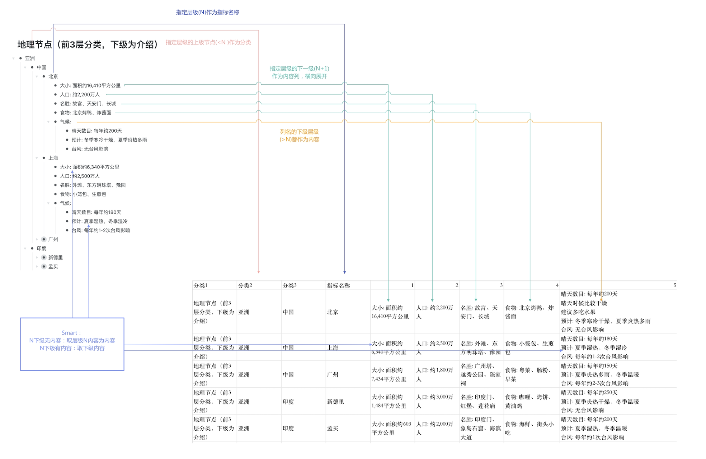
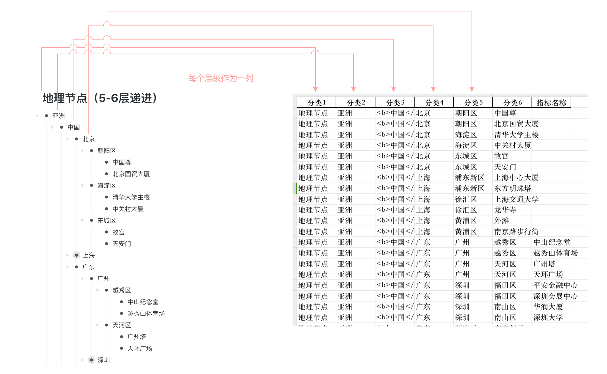

# OpmlToSheet

- V1.0 2025-01-17

## 1. 功能说明

将层级结构的OPML文件（如WorkFlowy、幕布、OmniOutliner等工具导出的OPML文件）转换为表格形式。

通过对分类层级数量(category_levels)的设置，可以将大纲内容转换成两种不同的表结构。

### 结构1

主要场景为记录某些事物的多个相同特征，如示例中不同地区城市的大小、人口、名胜、食物、气候。

将分类层级数量(category_levels)设置为事物所在层级即可。



### 结构2

场景广泛，大部分大纲数据数据的结构。

将分类层级数量(category_levels)设置为大纲的最深层级即可。




## 2. 参数介绍

### 2.1 分类层级数量
**功能描述：**  
指定不同的层级数会根本上影响转换表格的结构。


- **指定小于大纲的层级：**
  
  - 选定的层级作为指标名称。
  - 上级层级作为分类列。
  - 下一级层级横向展开为列，内容按规则填充。
  - **对应大纲内容：**
    ```
    - A
      - B
        - C
        - D
      - E
        - F
        - G
    ```
  - **生成表格：**
    
    ```
    分类1 | 指标名称 | 列1 | 列2
    -----|----------|-------|-------
    A    | B        | C     | D
    A    | E        | F     | G


- **覆盖整个大纲的层级：**
  - 每个层级作为一列，填充层级内容。
  - 【注意】已知问题：当层级参数大于大纲最深层级时，表格无内容。
  - **对应大纲内容：**
    ```
    - A
      - B
        - C
        - D
      - E
        - F
        - G
    ```
  - **生成表格：**
    ```
    分类1 | 分类2 | 分类3
    ------|-------|-------
    A     | B     | C
    A     | B     | D
    A     | E     | F
    A     | E     | G
    ```


### 2.2 是否指定列标题
**功能描述：**  
用户可选择是否指定列标题，影响表格生成的灵活性和精确度。


- **指定列标题的形式：**
  - 仅保留以标题开头的列。
  - 可按照提供的列标题调整列的顺序。
  - 智能去除列内容中的标题部分（支持“列名+冒号”和“列名+逗号”）。
  - **对应大纲内容：**
    ```
    - 分类: A
      - 指标名称: B
        - 子项1: C
        - 子项2: D
        - 子项3: E
    ```
  - **生成表格：**
    
    ```
    分类 | 指标名称 | 子项3 | 子项1
    -----|----------|-------|-------
    A    | B        | E     | C
    ```
  
  
  
- **不指定列标题的形式：**
  
  - 按照层级顺序自动生成列标题数字（表格生成后手工按需修改）。
  - **对应大纲内容：**
    ```
    - A
      - B
        - C
        - D
      - E
        - F
        - G
    ```
  - **生成表格：**
    
    ```
    分类 | 指标名称 | 列1 | 列2
    ----|-----|-----|-----
    A   | B   | C   | D
    A   | E   | F   | G
    ```


### **2.3 选择列内容的取值规则**

**功能描述：**  
在指定“指标层”（如第二层）后，决定是否取第三层的内容。


- **取层级内容和下级内容**

  - **对应大纲内容：**
    
    ```
    - A
      - B
        - C
        	- D
        - E
        	- F
      - G
        - H
        - I
    ```

  - **生成表格：**
    
    ```
    层级1 | 指标名称 | 列1 | 列2 
    ------|-------|-------|-------
    A     | B     | C     | E     
                    D       F
    A     | G     | H     | I
    ```


- **只取下级内容**
  - **对应大纲内容：**
    
    ```
    - A
      - B
        - C
        	- D
        - E
        	- F
      - G
        - H
        	- I
        - J
    ```

  - **生成表格：**
    
    ```
    层级1 | 指标名称 | 列1 | 列2 
    ------|-------|-------|-------
    A     | B     | D     | F     
    A     | G     | I     | 
    ```


- **智能判断**

  - **对应大纲内容：**
    
    ```
    - A
      - B
        - C
        	- D
        - E
        	- F
      - G
        - H
        	- I
        - J
    ```

  - **生成表格：**
    
    ```
    层级1 | 指标名称 | 列1 | 列2 
    ------|-------|-------|-------
    A     | B     | D     | F     
    A     | G     | I     | J
    ```


### **2.4 指定下级内容的深度**

**功能描述：**  
在指定“指标层”（如第二层）后，决定从第三层开始，向下取多少层的内容。


- **默认取一级下级内容**
  - **对应大纲内容：**
    
    ```
    - A
      - B
        - C
        	- D
        - E
        	- F
        	 - J
      - G
        - H
        - I
    ```

  - **生成表格：**

    ```
    层级1 | 指标名称 | 列1 | 列2 
    ------|-------|-------|-------
    A     | B     | C     | E     
                    D       F
    A     | G     | H     | I
    ```


- **指定下级内容的获取层级数**

  - **如指定2级**

  - **对应大纲内容：**
    
    ```
    - A
      - B
        - C
        	- D
        - E
        	- F
        	 - J
      - G
        - H
        - I
    ```

  - **生成表格：**
    
    ```
    层级1 | 指标名称 | 列1 | 列2 
    ------|-------|-------|-------
    A     | B     | C     | E     
                    D       F
                            J
    A     | G     | H     | I
    ```


## 3. 运行环境

已在 **MacOS 15** 系统中，对 **WorkFlowy、幕布、OmniOutliner** 导出的 **OPML** 文件进行测试。
**Python版本：3.11.3**。


